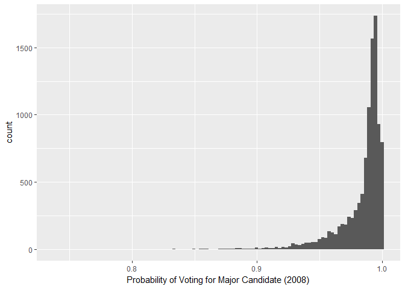
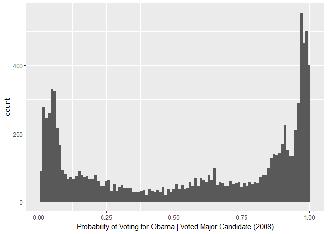

Logistic regression applied to voting
=====================================

A: Explore the exit poll data
-----------------------------

    #Read in data
    poll_data <- read_tsv("./Data/poll_data.tsv")

B: Build a logistic regression model
------------------------------------

    poll_data$vote_2008 <- factor(poll_data$vote_2008,levels = c("john mcCain","barack obama"))
    poll_data$race <- factor(poll_data$race,levels = c("white","black","hispanic","other"))
    #Run logistic model with all variables
    poll_model <- glm(formula = vote_2008 ~ 1 + .,family = "binomial",data = poll_data)

#### i. List the coefficients for each age group and gender; if your model does not fit all these coefficients, explain why not.

    #coefficients of age groups and gender
    poll_model$coefficients[which(names(poll_model$coefficients) %in% c("age30-44","age45-64","age65+","sexmale"))]

    ##     sexmale    age30-44    age45-64      age65+ 
    ## -0.02321378 -0.34525901 -0.40933955 -0.34643386

Keep in mind that these coefficients are relative to the reference
group. Being a male decreases the log odds of voting for Obama by 0.0232
when compared to being a female. The older the age bracket a person is
in, decreases the log odds of voting for Obama by above amounts when
compared to the 18-29 age bracket.

#### ii. Provide a summary of the model. What is your interpretation of these values?

    summary(poll_model)

    ## 
    ## Call:
    ## glm(formula = vote_2008 ~ 1 + ., family = "binomial", data = poll_data)
    ## 
    ## Deviance Residuals: 
    ##     Min       1Q   Median       3Q      Max  
    ## -3.6397  -0.4210   0.1453   0.4898   2.9262  
    ## 
    ## Coefficients: (3 not defined because of singularities)
    ##                                         Estimate Std. Error z value
    ## (Intercept)                            0.7728950  0.5111082   1.512
    ## stateAL                               -0.9283177  0.5812652  -1.597
    ## stateAR                               -0.7791709  0.6472584  -1.204
    ## stateAZ                               -1.0181255  0.5606299  -1.816
    ## stateCA                                0.3899819  0.5024413   0.776
    ## stateCO                                0.5377596  0.6125090   0.878
    ## stateCT                                0.5135716  0.5669621   0.906
    ## stateDE                                1.6362336  0.7837234   2.088
    ## stateFL                               -0.3171141  0.5140038  -0.617
    ## stateGA                               -0.3501227  0.5346900  -0.655
    ## stateIA                                0.7157400  0.5720926   1.251
    ## stateID                               -0.2264506  0.7020003  -0.323
    ## stateIL                                0.4037166  0.5109688   0.790
    ## stateIN                               -0.0393505  0.5420047  -0.073
    ## stateKS                                0.5196607  0.5673493   0.916
    ## stateKY                               -0.5645349  0.5577773  -1.012
    ## stateLA                               -1.0786104  0.5707627  -1.890
    ## stateMA                                0.1813207  0.5188453   0.349
    ## stateMD                                0.0008556  0.5284747   0.002
    ## stateME                               -0.0706587  0.7637887  -0.093
    ## stateMI                                0.0600245  0.5209558   0.115
    ## stateMN                                0.8942588  0.5411411   1.653
    ## stateMO                               -0.0175285  0.5334261  -0.033
    ## stateMS                               -1.3289590  0.6267929  -2.120
    ## stateMT                               -0.3677312  0.6770029  -0.543
    ## stateNC                               -0.3081837  0.5321354  -0.579
    ## stateND                               -0.0821673  0.7237198  -0.114
    ## stateNE                                0.4327525  0.6495645   0.666
    ## stateNH                                0.7635252  0.6352612   1.202
    ## stateNJ                                0.1787405  0.5237884   0.341
    ## stateNM                                0.5729611  0.6686517   0.857
    ## stateNV                               -0.2661867  0.6721246  -0.396
    ## stateNY                                0.2644574  0.5087728   0.520
    ## stateOH                                0.2487210  0.5127091   0.485
    ## stateOK                               -0.9143644  0.5835389  -1.567
    ## stateOR                                0.8361586  0.6192460   1.350
    ## statePA                                0.2829691  0.5140179   0.551
    ## stateRI                                0.8948555  0.6421285   1.394
    ## stateSC                               -0.1421306  0.5794928  -0.245
    ## stateSD                               -0.4784805  0.7256048  -0.659
    ## stateTN                               -0.7831691  0.5427035  -1.443
    ## stateTX                               -0.5605671  0.5153694  -1.088
    ## stateUT                                0.5888756  0.5847124   1.007
    ## stateVA                               -0.3279366  0.5337152  -0.614
    ## stateVT                                1.4447781  0.6992944   2.066
    ## stateWA                                0.7238504  0.5851117   1.237
    ## stateWI                                0.7239638  0.5337083   1.356
    ## stateWV                               -0.9515174  0.5974557  -1.593
    ## stateWY                               -0.3903291  0.8817166  -0.443
    ## sexmale                               -0.0232138  0.0623108  -0.373
    ## raceblack                              3.0717186  0.1837157  16.720
    ## racehispanic                           0.7213999  0.1190000   6.062
    ## raceother                              0.3310769  0.1472548   2.248
    ## age30-44                              -0.3452590  0.0964330  -3.580
    ## age45-64                              -0.4093395  0.0912896  -4.484
    ## age65+                                -0.3464339  0.1130235  -3.065
    ## educationdidn't graduate from HS      -0.0821327  0.1723655  -0.477
    ## educationhigh school graduate         -0.2107662  0.0861756  -2.446
    ## educationsome college                 -0.1780796  0.0731963  -2.433
    ## partyother                            -1.6237509  0.0758539 -21.406
    ## partyrepublican                       -3.4661454  0.0872796 -39.713
    ## ideologyliberal                        2.6216568  0.1048306  25.008
    ## ideologymoderate                       1.3754245  0.0728263  18.886
    ## state_contestednessquasi-battleground         NA         NA      NA
    ## state_contestednesssolid obama                NA         NA      NA
    ## state_contestednesssolid romney               NA         NA      NA
    ##                                       Pr(>|z|)    
    ## (Intercept)                           0.130484    
    ## stateAL                               0.110251    
    ## stateAR                               0.228666    
    ## stateAZ                               0.069364 .  
    ## stateCA                               0.437646    
    ## stateCO                               0.379964    
    ## stateCT                               0.365026    
    ## stateDE                               0.036819 *  
    ## stateFL                               0.537268    
    ## stateGA                               0.512587    
    ## stateIA                               0.210901    
    ## stateID                               0.747014    
    ## stateIL                               0.429469    
    ## stateIN                               0.942123    
    ## stateKS                               0.359696    
    ## stateKY                               0.311483    
    ## stateLA                               0.058789 .  
    ## stateMA                               0.726737    
    ## stateMD                               0.998708    
    ## stateME                               0.926292    
    ## stateMI                               0.908271    
    ## stateMN                               0.098424 .  
    ## stateMO                               0.973786    
    ## stateMS                               0.033985 *  
    ## stateMT                               0.587009    
    ## stateNC                               0.562491    
    ## stateND                               0.909607    
    ## stateNE                               0.505271    
    ## stateNH                               0.229399    
    ## stateNJ                               0.732919    
    ## stateNM                               0.391506    
    ## stateNV                               0.692077    
    ## stateNY                               0.603207    
    ## stateOH                               0.627597    
    ## stateOK                               0.117131    
    ## stateOR                               0.176925    
    ## statePA                               0.581974    
    ## stateRI                               0.163445    
    ## stateSC                               0.806250    
    ## stateSD                               0.509624    
    ## stateTN                               0.148996    
    ## stateTX                               0.276728    
    ## stateUT                               0.313877    
    ## stateVA                               0.538924    
    ## stateVT                               0.038824 *  
    ## stateWA                               0.216044    
    ## stateWI                               0.174947    
    ## stateWV                               0.111246    
    ## stateWY                               0.657988    
    ## sexmale                               0.709485    
    ## raceblack                              < 2e-16 ***
    ## racehispanic                          1.34e-09 ***
    ## raceother                             0.024555 *  
    ## age30-44                              0.000343 ***
    ## age45-64                              7.33e-06 ***
    ## age65+                                0.002176 ** 
    ## educationdidn't graduate from HS      0.633716    
    ## educationhigh school graduate         0.014454 *  
    ## educationsome college                 0.014978 *  
    ## partyother                             < 2e-16 ***
    ## partyrepublican                        < 2e-16 ***
    ## ideologyliberal                        < 2e-16 ***
    ## ideologymoderate                       < 2e-16 ***
    ## state_contestednessquasi-battleground       NA    
    ## state_contestednesssolid obama              NA    
    ## state_contestednesssolid romney             NA    
    ## ---
    ## Signif. codes:  0 '***' 0.001 '**' 0.01 '*' 0.05 '.' 0.1 ' ' 1
    ## 
    ## (Dispersion parameter for binomial family taken to be 1)
    ## 
    ##     Null deviance: 13655.4  on 9999  degrees of freedom
    ## Residual deviance:  6831.3  on 9937  degrees of freedom
    ## AIC: 6957.3
    ## 
    ## Number of Fisher Scoring iterations: 6

The log odds of voting for Obama is a positive one (as given by the
positive value of the intercept) with the reference demographic. In this
case, the reference demographic is a white, female, high school
graduate, 18-29 age bracket, democrat, with a conservative ideology
living in Alaska (AK). The other covariates coefficients describe the
increase or decrease in the log odds of voting for Obama based on the
state, race, age group, ideology, education level, and political party
the person is in. The reason for the NAs for the state\_contestedness
variables, is due to collinearity with the state info (I think).

#### iii. Convert the probabilistic predictions for each individual into binary predictions, based on the candidate they are most likely to vote for. Compute accuracy, precision, and recall for your predictions.

    #Convert to probabilistic predictions
    poll_model_pred <- predict(poll_model, type = 'response')
    #Change this to binary predictions based on if the predicted probability is >0.5 = "obama"
    poll_data <- mutate(poll_data, predict1 = ifelse(poll_model_pred > 0.5,"barack obama","john mcCain"))

    ## Warning: package 'bindrcpp' was built under R version 3.3.3

#### iv. Repeat step iii), but now convert each individual's prediction to a binary prediction for Obama only if the individual's probability of voting for Obama is at least 70%. What differences do you see in accuracy, precision, and recall compared to step iii)?

    #Change probability to binary predictions based on if the predicted probability is >=0.7 = "obama"
    poll_data <- mutate(poll_data, predict1 = ifelse(poll_model_pred >= 0.7,"barack obama","john mcCain"))

C: Download and explore the revised exit poll data
--------------------------------------------------

    #Read in data
    poll_data_full <- read_tsv("./Data/poll_data_full.tsv")

#### i. Using this revised exit poll data, build a binary logistic regression model to predict whether an individual voted for a major-party candidate in the 2008 elections. Make a histogram of the resulting predicted probabilities using ggplot2.

    #create a new variable collapsing obama and mcCain votes to 1 and others as 0
    poll_data_full = mutate(poll_data_full,major_or_not = ifelse(vote_2008 == "other",0,1))

    #Logistic Regression
    poll_full_model <- glm(formula = major_or_not ~ 1 + .,family = "binomial",data = poll_data_full %>% select(-vote_2008))

    #Convert to probabilistic predictions
    poll_full_model_pred <- predict(poll_full_model, type = 'response')

    #Histogram with predicted probabilities
    ggplot(poll_data_full %>% mutate(predictprob = poll_full_model_pred),aes(x=predictprob)) +
      geom_histogram(bins = 100) +
      labs(x = "Probability of Voting for Major Candidate (2008)")

#### ii. Filter the revised exit poll data to only individuals who actually voted for major party candidates. On this subset, build a binary logistic regression model to predict whether an individual voted for Obama. This gives an estimate of Pr(voted Obama | voted major party candidate).

    #filter the poll data to only individuals who actually voted for major party candidates
    poll_full_major_data <- filter(poll_data_full,major_or_not == 1)

    poll_full_major_data$vote_2008 <- factor(poll_full_major_data$vote_2008,levels = c("john mcCain","barack obama"))

    #Logistic regression
    poll_full_major_model <- glm(formula = vote_2008 ~ 1 + .,family = "binomial",data = poll_full_major_data %>% select(-major_or_not))

#### iii. Using the model from step ii), generate estimates of Pr(voted Obama | voted major party candidate) for every individual in the revised exit poll data, and make a histogram of the resulting predicted probabilities using ggplot2.

    #Convert to probabilistic predictions
    poll_full_major_model_pred <- predict(poll_full_major_model, type = 'response')

    #Histogram of the predicted conditional probability
    ggplot(poll_full_major_data %>% mutate(predictprob = poll_full_major_model_pred),aes(x=predictprob)) +
      geom_histogram(bins = 100) +
      labs(x = "Probability of Voting for Obama | Voted Major Candidate (2008)")

#### iv. Use the models from steps i) and ii) to compute, for each individual, the probability that the individual votes for the three candidates. Generate categorical predictions for each individual based on these probabilities, and report the accuracy of your classifier.
